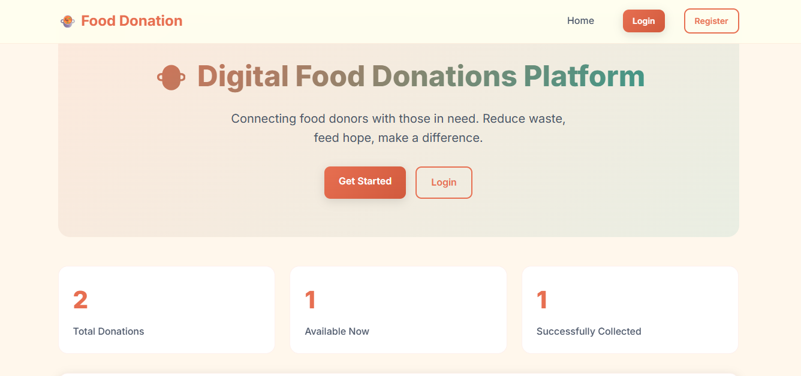
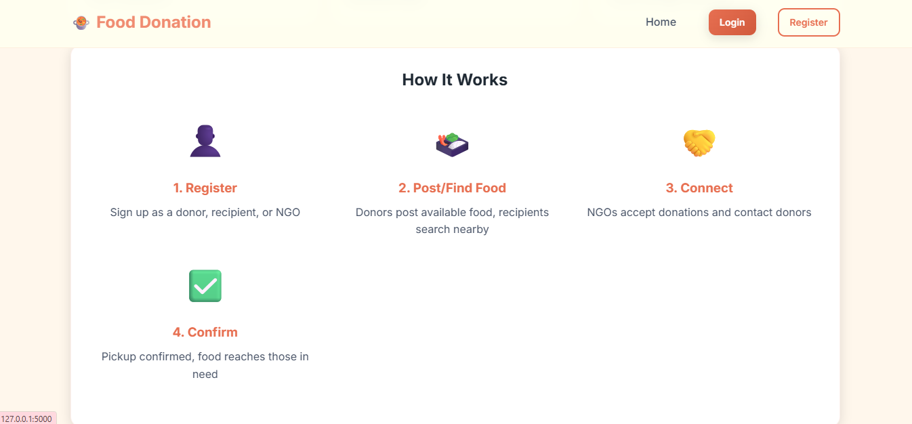
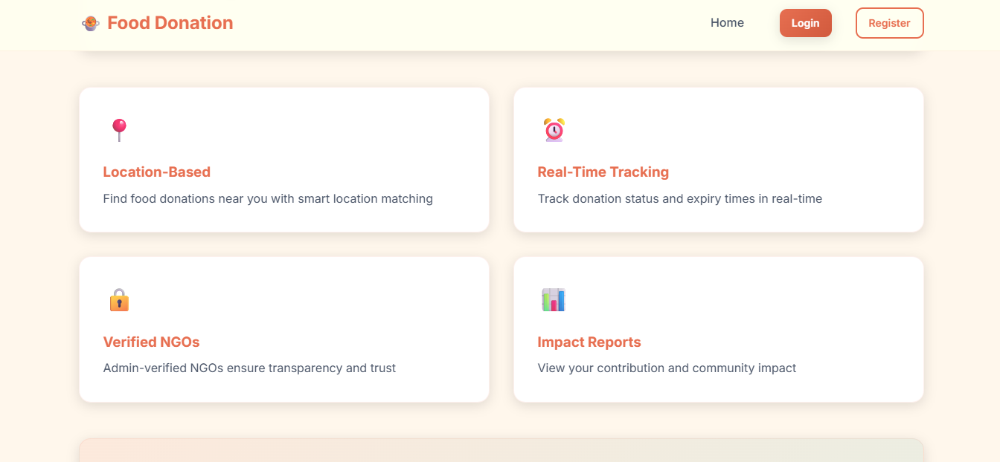
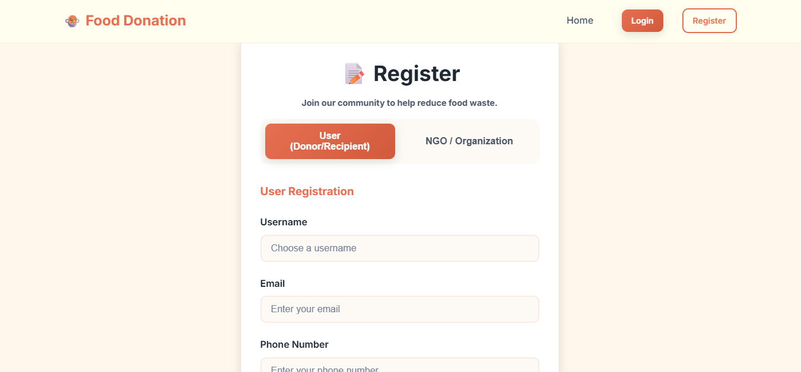
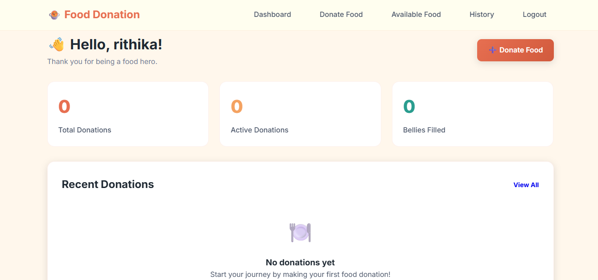

# 🍲 Digital Food Donations Platform

Connecting food donors (restaurants, hotels, and individuals) with recipients (NGOs, shelters, and people in need) to reduce food wastage through a centralized digital platform.

---

## 🚀 Overview

The **Digital Food Donations Platform** is a full-stack web application built using Flask. It helps tackle food waste by enabling real-time donation, tracking, and efficient distribution to those who need it most.

---

## 👥 User Roles & Features

### 👤 User (Donor / Recipient)
- **Registration & Login**: Secure access for individuals.
- **Post Donations**: Add food details (type, quantity, expiry time).
- **Find Food**: View available donations nearby.
- **Track Status**: Monitor whether donations are available, accepted, or collected.
- **History**: View comprehensive donation/request records.

### 🏢 NGO
- **Verification**: Dedicated registration with admin approval flow.
- **Nearby Matching**: Automatically see donations in your specific location.
- **Acceptance**: Accept donations to view donor contact details (phone).
- **Pickup Confirmation**: Mark food as collected once received.
- **Reports**: Keep track of collection statistics and impact.

### 👑 Admin
- **Dashboard**: Real-time analytics on users, NGOs, and donations.
- **Management**: Oversee all User and NGO accounts.
- **Verification**: Approve or reject NGO registration requests.
- **Donation Monitoring**: Monitor all active posts and remove invalid/fake ones.
- **Manual Cleanup**: Trigger expiry checks to remove outdated food posts.

---

## 🛠️ Tech Stack

- **Backend**: Python / Flask
- **Database**: SQLite (SQLAlchemy ORM)
- **Frontend**: HTML5, Vanilla CSS3 (Glassmorphism design), JavaScript
- **Authentication**: Flask-Login
- **Forms**: Flask-WTF

---

## ⚙️ Installation & Setup

### 1. Clone the repository
```bash
git clone <repository-url>
cd "Digital food donations platform"
```

### 2. Install Dependencies
```bash
pip install -r requirements.txt
```

### 3. Initialize the Database
This will create the necessary tables and a default admin account.
```bash
python verify_setup.py
```

### 4. Run the Application
```bash
python app.py
```
Access the app at: `http://localhost:5000`

---

## 🔑 Test Credentials (Dev Mode)

| Role | Email | Password |
|------|-------|----------|
| **Admin** | `admin@fooddonation.com` | `admin123` |
| **Donor (Sample)** | `donor1@example.com` | `password` |

---

## 📂 Project Structure

```text
├── app.py              # Main Flask application & routes
├── models.py           # SQLAlchemy database models
├── forms.py            # WTForms for validation
├── utils.py            # Helper functions & business logic
├── verify_setup.py     # Database initialization & testing
├── requirements.txt    # Project dependencies
├── static/
│   ├── css/style.css   # Custom Glassmorphism styling
│   └── js/main.js      # Frontend interactivity
└── templates/
    ├── base.html       # Layout template
    ├── auth/           # Login/Register templates
    ├── user/           # Donor/Recipient dashboards
    ├── ngo/            # NGO specific views
    └── admin/          # Admin management portal
```

---

## 🌱 Contribution

We reduce waste when we work together. Feel free to fork this project and contribute to its development!
## 📸 Screenshots

### Home Page



### Login Page


### Register Page


### User Dashboard


### NGO Dashboard


### Admin Dashboard
